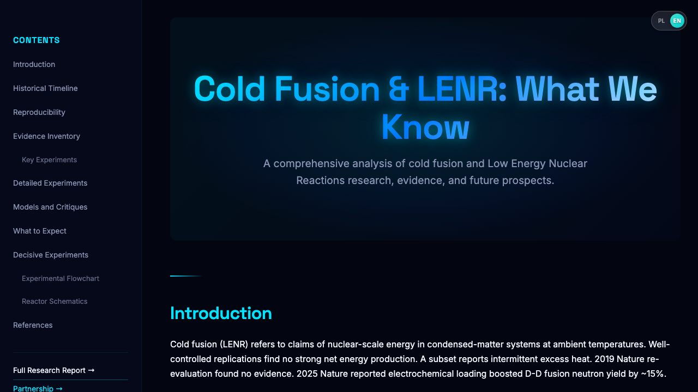

# Cold Fusion & LENR Research

[](https://opensource.org/licenses/MIT)
[](https://reactjs.org/)
[](https://www.typescriptlang.org/)
[](https://pages.cloudflare.com/)

A comprehensive, open-source research compilation on cold fusion and Low Energy Nuclear Reactions (LENR), providing scientific analysis of historical claims, experimental evidence, and future prospects.

## 🚀 Live Demo

- **Polish**: [https://www.zimnafuzja.pl](https://www.zimnafuzja.pl)
- **English**: [https://www.cold-fusion.org](https://www.cold-fusion.org) *(coming soon)*

## 📸 Screenshots


*Interactive timeline and evidence analysis of cold fusion research*

## ✨ Features

- **🌍 Bilingual Support**: Full Polish and English localization
- **📊 Interactive Timeline**: Historical progression from 1989 to present
- **🔍 Evidence Table**: Comprehensive analysis of experimental results  
- **⚛️ Reactor Diagrams**: Technical schematics of Pd-D and Ni-H systems
- **📚 86 Scientific References**: Complete bibliography organized by topic
- **📱 Responsive Design**: Optimized for desktop and mobile devices
- **⚡ Fast Performance**: Built with modern React 19 and Vite

## 🛠️ Tech Stack

- **Frontend**: React 19, TypeScript
- **Build Tool**: Vite
- **Styling**: CSS3 with CSS Variables
- **Deployment**: Cloudflare Pages
- **Icons**: Lucide React
- **Internationalization**: Custom i18n implementation

## 🚀 Getting Started

### Prerequisites

- Node.js 18+ 
- npm or yarn

### Installation

```bash
# Clone the repository
git clone https://github.com/your-username/cold-fusion.git
cd cold-fusion

# Install dependencies
npm install

# Start development server
npm run dev
```

Open [http://localhost:5173](http://localhost:5173) to view it in your browser.

## 📦 Build & Deploy

### Local Build

```bash
# Create production build
npm run build

# Preview production build locally
npm run preview
```

### Deploy to Cloudflare Pages

```bash
# Build the project
npm run build

# Deploy using Wrangler CLI
CLOUDFLARE_API_TOKEN="your-token" CLOUDFLARE_ACCOUNT_ID="your-account-id" npx wrangler pages deploy dist --project-name cold-fusion --commit-dirty=true
```

## 📁 Project Structure

```
cold-fusion/
├── public/                 # Static assets
├── src/
│   ├── components/        # React components
│   │   ├── Hero.tsx       # Landing section
│   │   ├── Timeline.tsx   # Historical timeline
│   │   ├── EvidenceTable.tsx
│   │   ├── References.tsx # Scientific bibliography
│   │   └── ...
│   ├── i18n.ts           # Internationalization
│   ├── LanguageContext.tsx
│   └── main.tsx
├── README.md
├── LICENSE
└── package.json
```

## 🔬 Content Overview

The application covers:

- **Historical Timeline**: From Fleischmann & Pons (1989) through DOE reviews, recent Nature studies, to 2026 NRC fusion regulation
- **Evidence Analysis**: Categorized evaluation of claimed observations (excess heat, nuclear products, etc.)
- **Reproducibility Issues**: Critical examination of experimental challenges and methodological problems
- **Theoretical Models**: Overview of proposed mechanisms and fundamental constraints
- **Future Prospects**: Baseline and breakthrough scenarios for LENR development

## 🤝 Contributing

We welcome contributions! Please see our [Contributing Guide](CONTRIBUTING.md) for details.

### Quick Start for Contributors

1. Fork the repository
2. Create a feature branch (`git checkout -b feature/amazing-feature`)
3. Make your changes
4. Run tests and linting (`npm run test`, `npm run lint`)
5. Commit your changes (`git commit -m 'Add amazing feature'`)
6. Push to your branch (`git push origin feature/amazing-feature`)
7. Open a Pull Request

## 📄 License

This project is licensed under the MIT License - see the [LICENSE](LICENSE) file for details.

## 🙏 Credits

**Created by [Xfaang](https://github.com/xfaang)**

This project aims to provide objective, scientific analysis of cold fusion research for educational and research purposes.

---

For questions, suggestions, or collaboration opportunities, please open an issue or reach out via GitHub.